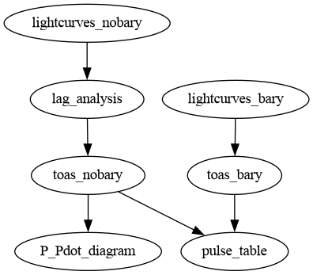

# GPMTransient
Repository of code and data supporting the newly discovered active long-period radio transient

## Position

- **RA**: 18:39:02.0 (18.6505 hrs, 279.7583 deg)
- **Dec**: -10:31:49.5 (-10.5304 deg)
- **Uncertainty**: 0.15"

## Analyses

Each recipe below corresponds to a different folder within this one.
In some cases, the subfolder has its own `README.md` with more in-depth instructions.

Some subfolders are prerequisites for others, according to the following diagram:



To re-make the flowchart:

```
dot -Tpng flowchart.dot > flowchart.png
```

The listed command(s) are inteded to be run in the corresponding subfolder.
In all of the below, if there are `make` commands, you can use the `-j` command to parallelise execution.

<details>
<summary><b>lightcurves_nobary</b>: Prepare lightcurves <i>without</i> barycentring</summary>

```
make lightcurves
```

Expected output: `*_lightcurve.txt` files

</details>

<details>
<summary><b>lag_analysis</b>: Combining same-pulse lightcurves and lag analysis</summary>

```
python lag_analysis.py
```

Expected output: `*_lightcurve_mod.txt` files

</details>

<details>
<summary><b>toas_nobary</b>: Get the non-barycentred TOAs</summary>

```
make all_toas_mod.tim
```

Expected output: `all_toas_mod.tim`

</details>

<details>
<summary><b>toas_bary</b>: Get the barycentred TOAs</summary>

```
make all_toas.tim
```

Expected output: `all_toas_mod.tim`

</details>

<details>
<summary><b>P_Pdot_diagram</b>: Grid search in F0 and F1</summary>

To generate `chi2_grid.csv`:
```
python grid_search_f_fdot.py dofit.par ../toas_nobary/all_toas_mod.tim
```

To generate `Ppdot_search.pdf`:
```
python plot_P_Pdot_search.py
```

</details>

<details>
<summary><b>make_table</b>: Generate `.tex` and `.csv` tables of individual pulse information</summary>

```
python make_table.py
```

</details>

### Results

Some (not necessarily all) of the final figures and tables that result from the above analyses are also git-tracked.
Such files are kept in the `upload_materials` folder so that they do not clash with the files generated by the analysis scripts.

If the analysis scripts are changed in any way that affects the results, the way to affirm the new results is to copy the relevant file(s) into the `upload_materials` folder and overwrite the previous version.

