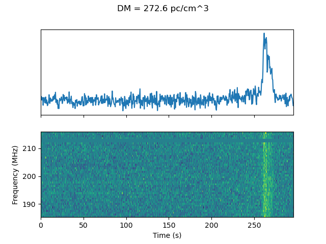
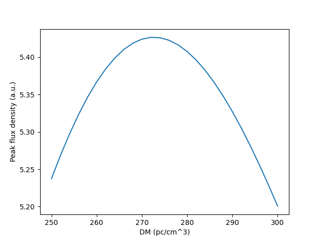
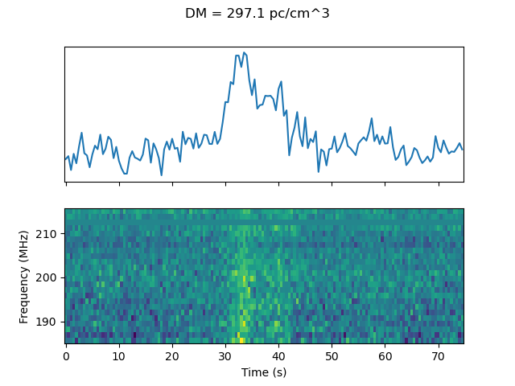
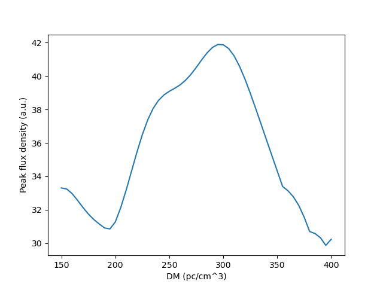
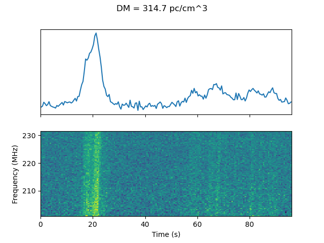
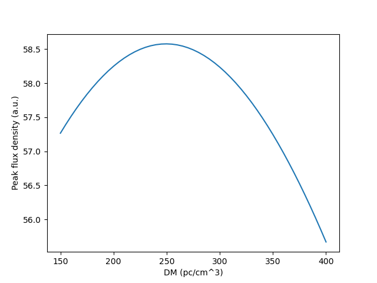
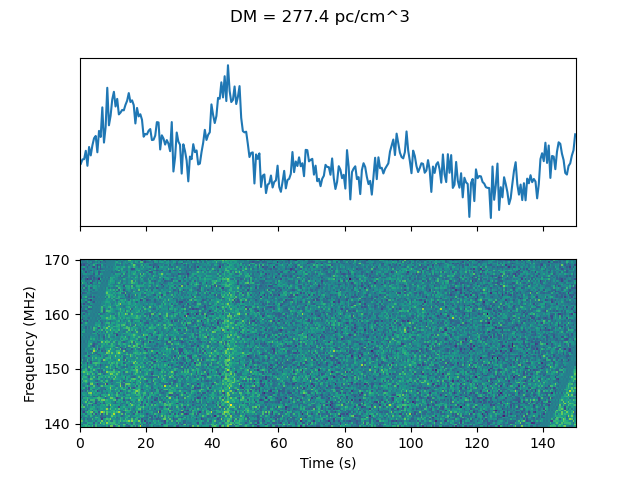
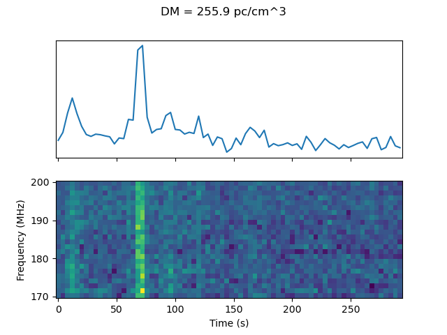
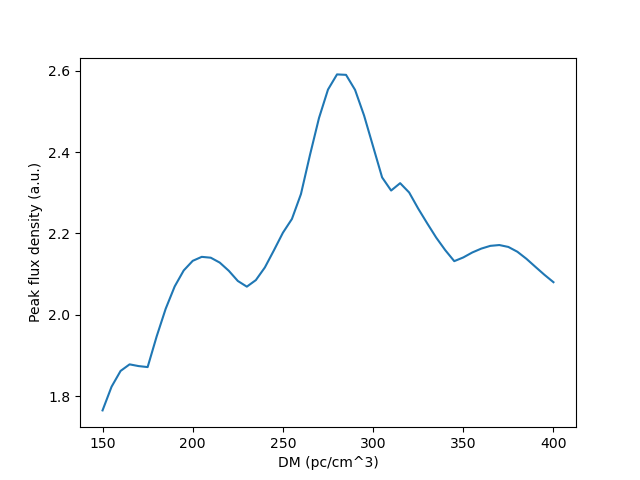

# Dedispersing dynamic spectra

The `csv` files in this directory are for the recently discovered 20-minute transient in the Galactic Plane.

## Results

#### 1340639536

```
python dedisperse_dynspec.py --transpose --sample_time 0.5 --freqlo 185.595 --dms 150 401 5 --input 1340639536_dynamic_spectrum_pad.csv
```




#### 1340641016

```
python dedisperse_dynspec.py --transpose --sample_time 0.5 --freqlo 185.595 --dms 150 401 5 --input 1340641016_dynamic_spectrum_pad.csv
```




#### 1342096104

```
python dedisperse_dynspec.py --transpose --sample_time 4 --freqlo 200.955 --dms 150 401 5 --input 1342096104_dynamic_spectrum.csv
```




#### 1342096400

```
python dedisperse_dynspec.py --transpose --sample_time 4 --freqlo 139.515 --dms 150 401 5 --input 1342096400_dynamic_spectrum.csv
```




**NB:** Dedispersion method treats window as periodic, so flux "wraps" to the end of observation. More padding needed to avoid this.

#### 1342097584

```
python dedisperse_dynspec.py --transpose --sample_time 4 --freqlo 170.235 --dms 150 401 5 --input 1342097584_dynamic_spectrum.csv
```




