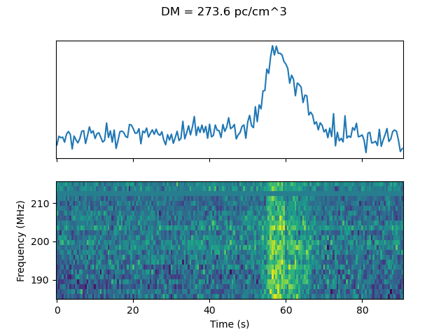
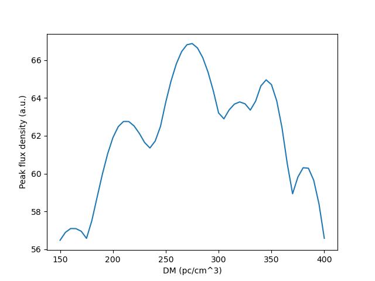
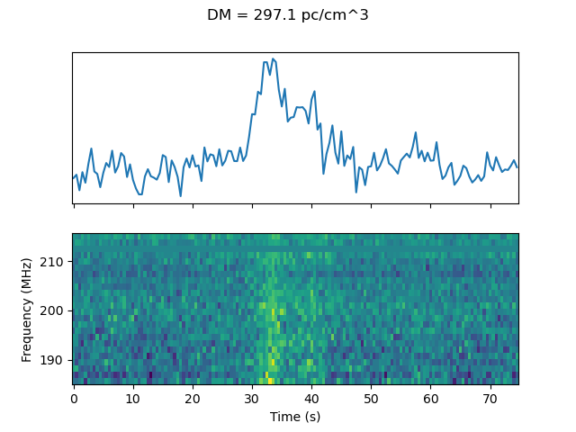
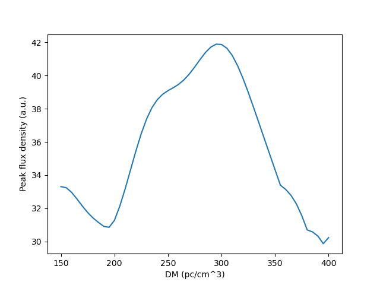

# Dedispersing dynamic spectra

The `csv` files in this directory are for the recently discovered 20-minute transient in the Galactic Plane.

## Results

```
python dedisperse_dynspec.py --transpose --sample_time 0.5 --freqlo 185.595 --dms 150 401 5 --input 1340639536_dynamic_spectrum_pad.csv
```




```
python dedisperse_dynspec.py --transpose --sample_time 0.5 --freqlo 185.595 --dms 150 401 5 --input 1340641016_dynamic_spectrum_pad.csv
```



