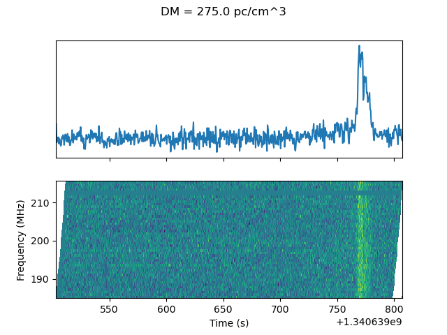

# Dedispersing dynamic spectra

The `csv` files in this directory are for the recently discovered 20-minute transient in the Galactic Plane.

The `.yaml` files contain metadata associated with each observation that is used to form the data products such as dediserpsed spectra and lightcurves.
Most of the data products can be produced by using the `dedisperse_dynspec.py` script.

## Dependencies

- Python modules:
  - `numpy`
  - `scipy`
  - `astropy`
  - [`spiceypy`](https://spiceypy.readthedocs.io/en/main/)
    - This also requires a planetary ephemeris for the barycentric correction. We use the `de430.bsp` ephemeris, which can be downloaded from [http://naif.jpl.nasa.gov/pub/naif/generic_kernels/spk/planets/de430.bsp](http://naif.jpl.nasa.gov/pub/naif/generic_kernels/spk/planets/de430.bsp) (or by running `make de430.bsp` in this directory).

## Making individual dedispersed spectra

Example:
```
python dedisperse_dynspec.py --transpose --sample_time 0.5 --freqlo 185.595 --bw 0.64 --dms 288 --input 1340639536_dynamic_spectrum_pad.csv --dynspec_image dediserpsed_spectra/1340639536_dedispersed.png
```
or
```
python dedisperse_dynspec.py --dms 288 --dynspec_image dediserpsed_spectra/1340639536_dedispersed.png --yaml 1340639536.yaml
```


Alternatively,
```
make dediserpsed_spectra/1340639536_dedispersed.png
```
will attempt to construct the above command line call using the values in `observations.txt`.
This method uses the DM set by the `BEST_DM` variable at the top of `Makefile`.

## Time-corrected light curves

To get time-corrected lightcurves (i.e. with both the barycentric and DM corrections applied) run
```
make all_lightcurves
```
This uses a DM set by the `BEST_DM` variable at the top of the `Makefile`.

## Barycentric correction

The file `observations.txt` contains a column listing the barycentric correction.
These numbers are positive and, for the first few observations at least, get smaller over time.
Since the (first few) observations start in late June, and since the source has an RA of ~18 hrs, we can say that the Earth is closest to the source at this time, and only gets further away from the source over the next months.
We can conclude therefore, that the numbers in the column should be interpreted as "the number that should be ***added*** to the arrival time in order to give a calculated arrival time at the barycentre."

## Gallery

**...YET TO DO...**
