# Dedispersing dynamic spectra

The `csv` files in this directory are for the recently discovered 20-minute transient in the Galactic Plane.

| GPS time      | Telescope     | Integration time (s) | Channel width (MHz) | Centre of first channel (MHz) |
| ------------- |:-------------:| :------------------: | :-----------------: | :---------------------------: |
| [1340639536](#1340639536) | MWA | 0.5 | 1.28 | 185.595 |
| [1340641016](#1340641016) | MWA | 0.5 | 1.28 | 185.595 |
| [1341930288](#1341930288) | MWA | 0.5 | 1.28 | 139.515 |
| [1341932656](#1341932656) | MWA | 0.5 | 1.28 | 200.955 |
| [1341932952](#1341932952) | MWA | 0.5 | 1.28 | 139.515 |
| [1341937984](#1341937984) | MWA | 0.5 | 1.28 | 200.955 |
| [1341938280](#1341938280) | MWA | 0.5 | 1.28 | 139.515 |
| [1341939168](#1341939168) | MWA | 0.5 | 1.28 | 139.515 |
| [1341939760](#1341939760) | MWA | 0.5 | 1.28 | 200.955 |
| [1342095399](#1342095399) | Murriyang | 0.1 | 0.5 | 1216.0 |
| [1342096104](#1342096104) | MWA | 0.5 | 0.32 | 200.955 |
| [1342096400](#1342096400) | MWA | 0.5 | 0.32 | 139.515 |
| [1342097584](#1342097584) | MWA | 0.5 | 0.32 | 170.235 |

## Results

#### 1340639536

```
python dedisperse_dynspec.py --transpose --sample_time 0.5 --freqlo 185.595 --dms 150 401 5 --input 1340639536_dynamic_spectrum_pad.csv
```


#### 1340641016

```
python dedisperse_dynspec.py --transpose --sample_time 0.5 --freqlo 185.595 --dms 150 401 5 --input 1340641016_dynamic_spectrum_pad.csv
```


#### 1341930288

```
python dedisperse_dynspec.py --transpose --sample_time 0.5 --freqlo 139.515 --dms 150 401 5 --input 1341930288_dyn_dynamic_spectrum.csv
```


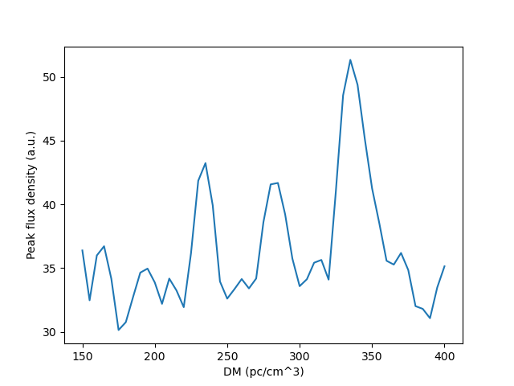

#### 1341932656

```
python dedisperse_dynspec.py --transpose --sample_time 0.5 --freqlo 200.955 --dms 150 401 5 --input 1341932656_dyn_dynamic_spectrum.csv
```

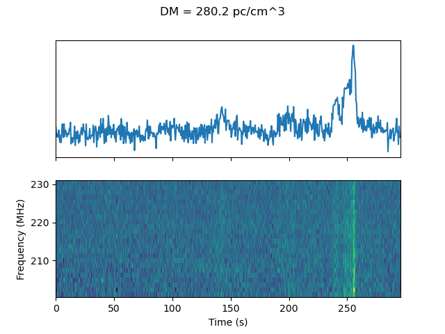
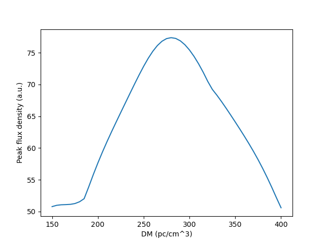

#### 1341932952

```
python dedisperse_dynspec.py --transpose --sample_time 0.5 --freqlo 139.515 --dms 150 401 5 --input 1341932952_dyn_dynamic_spectrum.csv
```

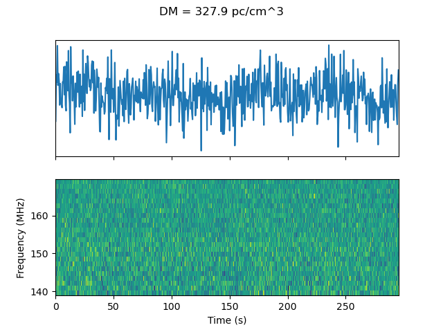
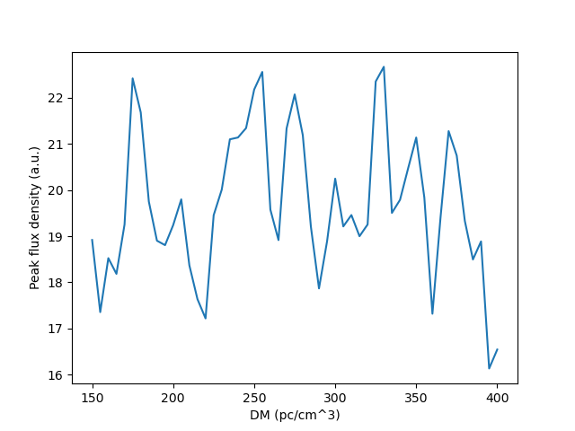

#### 1341937984

```
python dedisperse_dynspec.py --transpose --sample_time 0.5 --freqlo 200.955 --dms 150 401 5 --input 1341937984_dyn_dynamic_spectrum.csv
```

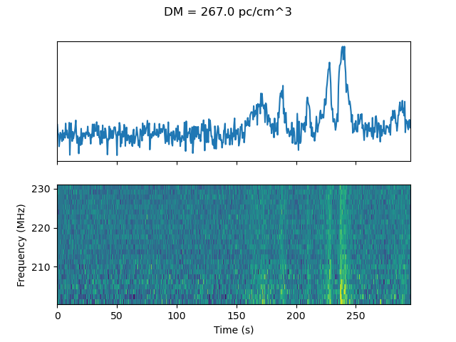
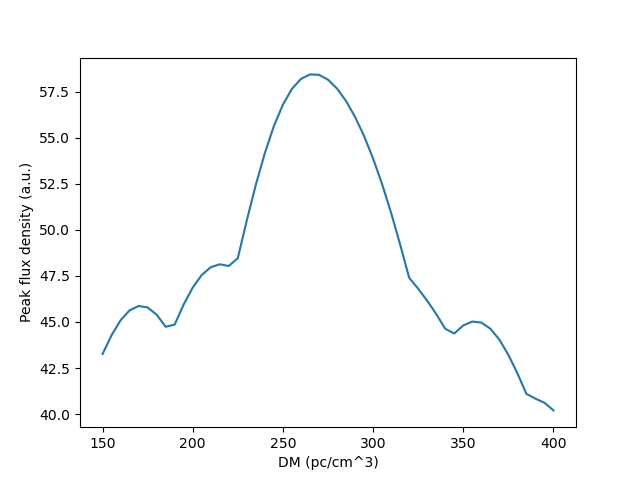

#### 1341938280

```
python dedisperse_dynspec.py --transpose --sample_time 0.5 --freqlo 139.515 --dms 150 401 5 --input 1341938280_dyn_dynamic_spectrum.csv
```

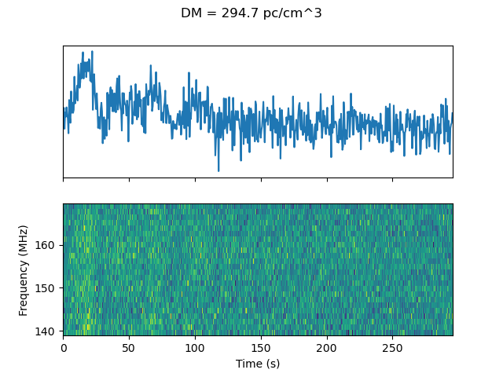
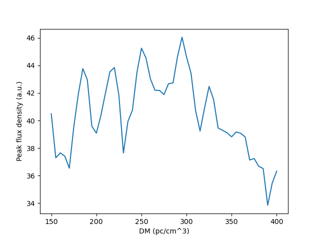

#### 1341939168

```
python dedisperse_dynspec.py --transpose --sample_time 0.5 --freqlo 139.515 --dms 150 401 5 --input 1341939168_dyn_dynamic_spectrum.csv
```

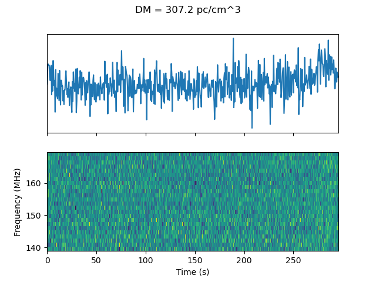
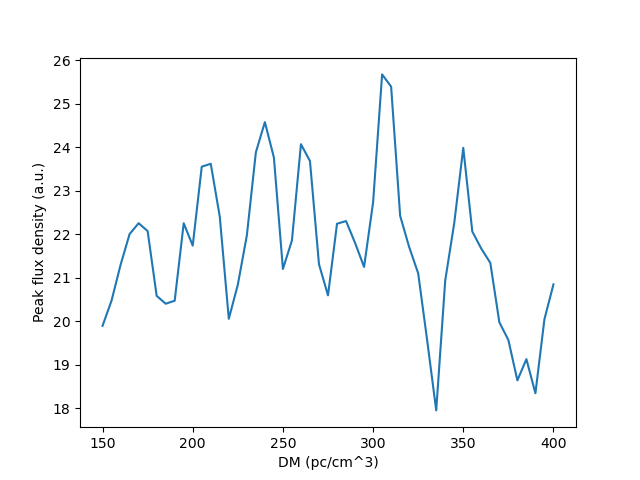

#### 1341939760

```
python dedisperse_dynspec.py --transpose --sample_time 0.5 --freqlo 200.955 --dms 150 401 5 --input 1341939760_dyn_dynamic_spectrum.csv
```

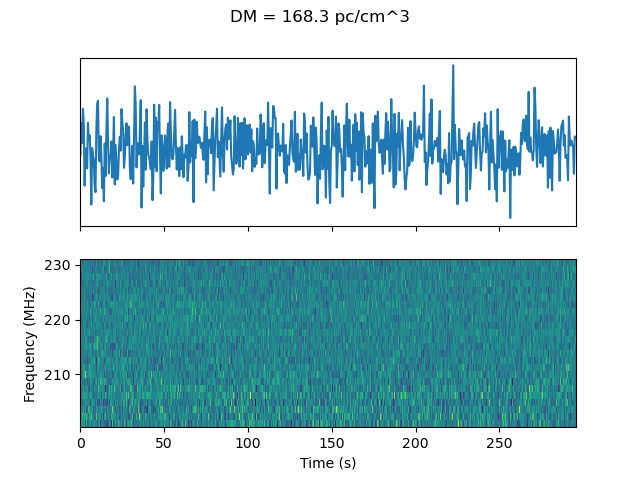
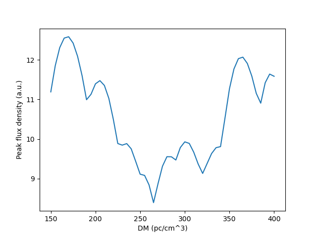

#### 1342095399
```
run dedisperse_dynspec.py --sample_time 0.1 --freqlo=1216.0 --bw 0.5 --dms 100 400 2 --input PKS_1342095399_dynamic_spectrum.csv
```
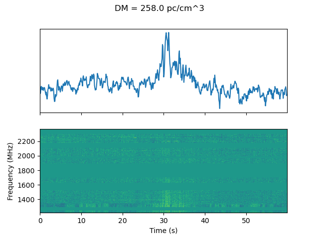
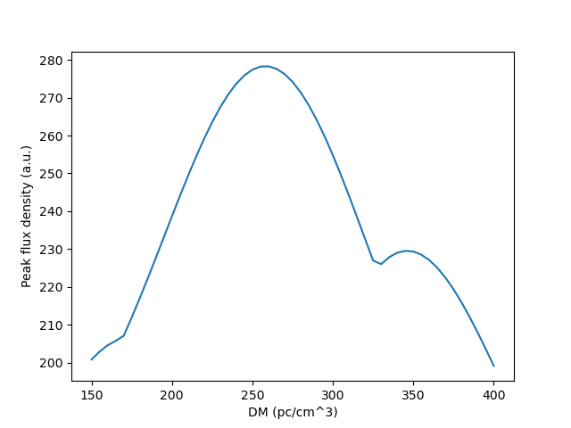

#### 1342096104

```
python dedisperse_dynspec.py --transpose --sample_time 0.5 --bw 0.32 --freqlo 200.955 --dms 150 401 5 --input 1342096104_dynamic_spectrum.csv
```


**Looks like the DM curve gets the DM 'wrong' here.**

#### 1342096400

```
python dedisperse_dynspec.py --transpose --sample_time 0.5 --bw 0.32 --freqlo 139.515 --dms 150 401 5 --input 1342096400_dynamic_spectrum.csv
```


**NB:** Dedispersion method treats window as periodic, so flux "wraps" to the end of observation. More padding needed to avoid this.

#### 1342097584

```
python dedisperse_dynspec.py --transpose --sample_time 0.5 --bw 0.32 --freqlo 170.235 --dms 150 401 5 --input 1342097584_dynamic_spectrum.csv
```


