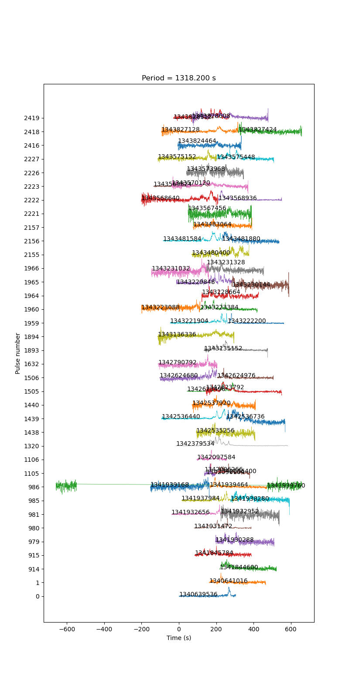
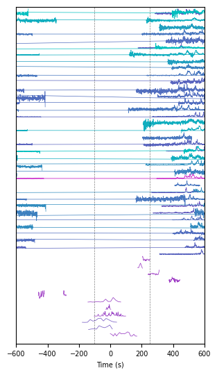

# Pulsestacks

The PNG is displayed below.

There is also an SVG in this folder.
The annotations on the SVG plot contain relative links to the corresponding dynamic spectra, but they aren't clickable when viewing on GitHub.
But, if you open the downloaded SVG as a local file in the browser, the links should work.

**NOTE**: The links are merely relative paths to the dedispersed spectra images, which must obviously exist first.
They can be created by navigating to the parent directory and running
```
mkdir -p dedispersed_spectra
make all_dedispersed_spectra
```

## Making the pulsestacks

In the parent folder, open the `Makefile` and set the `DM` variable to the desired DM.
Then, run
```
make -B -j4 all_lightcurves
```
to remake all the lightcurves, and
```
make pulsestack_<P>s_DM_<DM>.png
```
where `<P>` is the desired folding period in seconds, and `<DM>` must match the `DM` variable set in `Makefile`.

## Dedispersed to 288 pc/cm^3



## Dedispersed to 288 pc/cm^3



