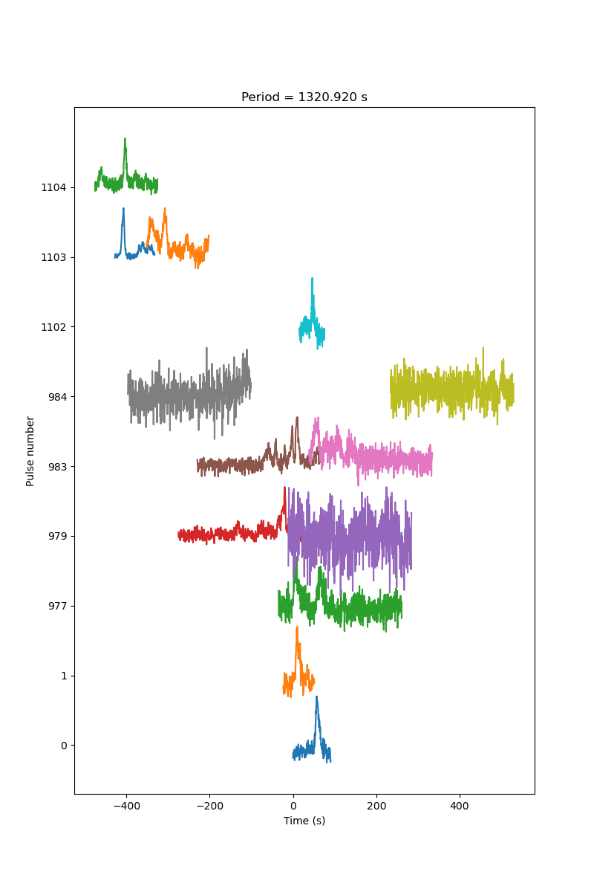

# Pulsestacks at different periods

#### 1320.92 s

This is to try and get the Parkes pulse (pulse #1102 on this plot) to line up.

#### 1318.2 s

This is to try and get the last few MWA pulses (pulses #1105 and #1106 on this plot) to line up.

